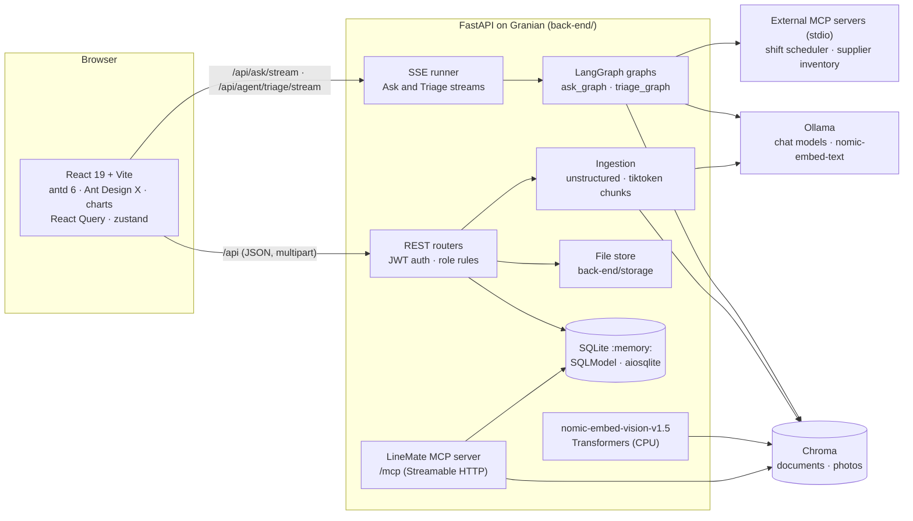

# LineMate

LineMate is a kitchen operations assistant for **Hearthline**, a restaurant kitchen with four stations: Grill, Pastry, Prep and Front of House. Crew members ask questions in plain language and get answers grounded in the kitchen's own SOPs, recipes, onboarding guides and incident reports. Every answer cites its sources and warns when a source is past its review date. The same app also runs the ticket board, the document lifecycle, stale-document and ownership audits, workload analytics, an agentic shift-triage workflow with human approval, and an MCP server that lets other AI clients use LineMate's tools.

Everything runs locally:

* a FastAPI back-end;
* a React front-end;
* Ollama for chat and text embeddings;
* a local Transformers model for photo embeddings;
* Chroma for vectors;
* an in-memory SQLite database that is rebuilt and seeded on every start.

---

## Contents

1. [Features](#features)
2. [Roles and permissions](#roles-and-permissions)
3. [Architecture](#architecture)
4. [Technology stack](#technology-stack)
5. [Repository layout](#repository-layout)
6. [Prerequisites](#prerequisites)
7. [Getting started](#getting-started)
8. [Seeded accounts](#seeded-accounts)
9. [Seed data and sample documents](#seed-data-and-sample-documents)
10. [Documents, uploads and file storage](#documents-uploads-and-file-storage)
11. [Retrieval-augmented answers](#retrieval-augmented-answers)
12. [Models, reasoning and the model registry](#models-reasoning-and-the-model-registry)
13. [Agents (LangGraph)](#agents-langgraph)
14. [Human-in-the-loop approvals](#human-in-the-loop-approvals)
15. [MCP server and MCP clients](#mcp-server-and-mcp-clients)
16. [Authentication and security](#authentication-and-security)
17. [API reference](#api-reference)
18. [Streaming events (SSE)](#streaming-events-sse)
19. [Configuration](#configuration)
20. [Testing and quality checks](#testing-and-quality-checks)
21. [Building for production](#building-for-production)
22. [Troubleshooting](#troubleshooting)

---

## Features

| Area | What it does |
| --- | --- |
| **Ask LineMate** | The chat screen is built with Ant Design X (`useXChat` with a custom chat provider, `Bubble`, `Sender`, `Conversations`, `Prompts`, `Think`, `ThoughtChain`, `Sources`, `Attachments`, `Suggestion`) and `@ant-design/x-markdown`. Answers stream in token by token. Each answer cites numbered sources and flags stale documents. Memory is kept per conversation, the model's reasoning can be shown, and questions can include photos. Saved chats can be reopened, renamed and deleted. Admins can compare two models side by side. |
| **Model choice** | The model picker lists every chat-capable model installed in Ollama (for example `llama3.2:3b`, `qwen3:4b-q4_K_M` and `gemma4:e2b`), limited to what the admin allows for the user's role. Newly pulled models show up automatically. |
| **Reasoning (chain of thought)** | Models that can think stream their reasoning into a collapsible `Think` panel. The reasoning switch is enabled for models that can turn thinking on and off, locked on for models that always think, and disabled for models that cannot think. |
| **Photos** | When a photo is attached to a question, LineMate reads it with OCR, embeds it with `nomic-embed-vision-v1.5`, matches it against photos already on file (ticket attachments) and retrieves the related SOPs. Vision-capable chat models also receive the image itself. |
| **Tickets** | A filterable ticket board and a detail view per ticket. Each ticket has a threaded discussion; status, priority and assignee controls; activity history; linked SOPs; and photo or file attachments, which are indexed for photo search. |
| **Documents** | A knowledge base with category, station, owner and review status for each document. You can: <ul><li>upload PDF, Word, PowerPoint, Excel, Markdown, text or image files</li><li>follow each upload through the ingestion steps (store, parse, chunk, embed, index)</li><li>replace a file with a new version</li><li>mark documents as reviewed one at a time or in bulk</li><li>archive documents</li></ul> |
| **Audits** | <ul><li>**Stale-document audit:** documents past the review threshold, with how often each one was cited this week.</li><li>**Ownership audit:** tickets assigned outside the station that owns the relevant SOP, with a suggested reassignment.</li></ul> |
| **Workload analytics** | Open tickets per station, a weighted load index, the priority mix and the tickets opened per day over the last 30 days, drawn with `@ant-design/charts`. |
| **Shift triage** | A LangGraph agent that ranks open tickets, attaches the owning SOP, checks the roster and supplier stock over MCP, and detects risks. It then writes a shift summary and proposes actions (supply orders, reassignments, escalations). Every step streams live progress. |
| **Approvals** | Write actions proposed by agents or MCP clients wait in an approvals queue. Only the Kitchen Manager can approve or reject them; the paused agent run then resumes. |
| **Agent inspector** | The history of agent runs, with each step's inputs, outputs and timings, plus diagrams of both agents generated from the running back-end. |
| **MCP console** | <ul><li>The six tools LineMate exposes at `/mcp`, each with a "Try it" form</li><li>The two external MCP servers LineMate uses</li><li>Service-token management</li></ul> |
| **Administration** | <ul><li>User accounts (role, station, active)</li><li>Which models each role can use</li><li>Loading and unloading models, and their memory use</li><li>Vector store health, re-indexing and cleanup of stale vectors</li></ul> |
| **Create Account** | Self-service sign-up creates a Line Cook account on the chosen station and signs the user in. |
| **Responsive UI** | A branded Ant Design 6 theme with light and dark modes. The layout adapts from wide desktops down to phones: a navigation drawer, stacked cards and scrollable tables. |

---

## Roles and permissions

The rules are defined in one place on the server (`back-end/src/back_end/auth/permissions.py`). The REST API, the agents and the MCP server all enforce them. The front-end keeps a copy only to decide what to show.

| Capability | Line Cook | Sous Chef | Kitchen Manager | Admin |
| --- | --- | --- | --- | --- |
| Ask LineMate | Yes | Yes | Yes | Yes, plus model comparison |
| Read recipes, SOPs, onboarding | Yes | Yes | Yes | Yes |
| Read incident reports | No (left out of search results and answers) | Yes | Yes | Yes |
| Open tickets, comment, attach files, raise priority | Yes | Yes | Yes | No |
| Change ticket status | Tickets assigned to them | Own station | All | No |
| Lower priority, close, assign | No | Own station | All | No |
| Upload documents | No | Recipes, onboarding guides and incident reports for their own station (not SOPs) | Everything | No |
| Mark documents reviewed | No | Own station | All | No |
| Archive documents | No | No | Yes | No |
| Stale-document audit, workload analytics | No | Own station | All stations | All stations |
| Ownership audit, shift triage | No | Own station | All stations | No |
| View approvals | No | Yes | Yes | Yes |
| **Approve or reject** | No | No | **Yes (the only role)** | No (separation of duties) |
| Agent runs | No | Own runs | Own runs | All runs |
| MCP console | No | Yes | Yes | Yes, plus service tokens |
| Users, model access, vector store | No | No | No | Yes |

A fifth role, **Service (MCP)**, belongs to service tokens. It can call any MCP tool that lists the role (for example `create_ticket`), but its write tools still only create approval requests.

---

## Architecture



* **Database.** Every table is a SQLModel model in an in-memory SQLite database, reached through SQLAlchemy's async engine and `aiosqlite`. That includes users, crew, stations, documents, chunks, file assets, tickets, comments, activity, approvals, conversations, messages, agent runs, model access, MCP servers, tools, tokens and ingest jobs. The schema is created and the seed data loaded on every start, so each run begins from the same known state.
* **Vectors.** Chroma stores its data in `back-end/chroma_db/`. Text chunks and photos go into two separate collections, because text and image embeddings have different score scales. On start-up, LineMate indexes the seed documents and photos (skipping anything unchanged) and removes vectors that no longer belong to a live document.
* **Files.** Uploaded documents, ticket attachments and chat photos are stored under `back-end/storage/`. The browser only ever receives short-lived signed download URLs.
* **Streaming.** Ask and Triage run as LangGraph graphs. A runner turns each graph's progress updates and custom events into server-sent events, which the front-end renders live.

---

## Technology stack

### Back-end (`back-end/`)

| Concern | Library (version in `uv.lock`) |
| --- | --- |
| Runtime and packaging | Python 3.13.5, uv (`pyproject.toml`, `uv.lock`) |
| ASGI server | Granian 2.8 |
| Web framework | FastAPI 0.142 (`fastapi[standard]`), python-multipart |
| Validation and settings | Pydantic 2.13, pydantic-settings 2.15 |
| ORM and database | SQLModel 0.0.47 on SQLAlchemy 2.0.54 (async engine), aiosqlite 0.22. SQLModel requires SQLAlchemy below 2.1, so the 2.0 series is used. |
| Authentication | PyJWT 2.15 (HS256 access tokens), argon2-cffi 25.1 (hashing passwords and service tokens) |
| LLM orchestration | LangChain 1.4 (LCEL), LangGraph 1.2, langchain-ollama, langchain-chroma, langchain-text-splitters |
| Structured planning | Pydantic AI 2.52 (the triage planner returns a typed action plan) |
| Vector store | Chroma 1.5 |
| Parsing and chunking | unstructured 0.22 (`[all-docs]`), tiktoken 0.14 |
| Photo embeddings | Transformers 4.57 and PyTorch (CPU build) running `nomic-ai/nomic-embed-vision-v1.5` |
| MCP | MCP SDK 2.2 (`mcp[cli]`), for both the server and the clients |
| Data | pandas 3.0, numpy 2.5 |
| Logging | structlog 26 |
| Tests and tooling | pytest 9, pytest-asyncio 1.4, pytest-cov, FastAPI `TestClient`, httpx and httpx2, Ruff |

### Front-end (`front-end/`)

| Concern | Library |
| --- | --- |
| Build and dev server | Vite 8, TypeScript 6, React 19 |
| UI components | antd 6.6, @ant-design/icons |
| AI chat UI | @ant-design/x 2.9, @ant-design/x-sdk 2.9, @ant-design/x-markdown 2.9, @ant-design/x-card 2.9 |
| Charts | @ant-design/charts 2.6 |
| Routing and data | react-router-dom 7, @tanstack/react-query 5, zustand 5, jwt-decode 4, dayjs |
| Tests | Vitest 5, @vitest/coverage-v8, Mock Service Worker 2, Testing Library, jsdom |
| Lint and format | oxlint, Prettier |

### Local AI services

| Service | Used for |
| --- | --- |
| Ollama | Chat models and the `nomic-embed-text` text embedding model |
| Hugging Face model cache | `nomic-ai/nomic-embed-vision-v1.5`, downloaded on first start and run inside the API process |

---

## Repository layout

```text
.
├── README.md
├── back-end/
│   ├── pyproject.toml · uv.lock · .env.example · README.md
│   ├── src/back_end/
│   │   ├── main.py              FastAPI app factory, lifespan (seed + index), Granian entry point
│   │   ├── core/                settings, logging, errors, security (JWT, Argon2, signed URLs)
│   │   ├── auth/                role rules and FastAPI dependencies
│   │   ├── db/                  SQLModel tables and the async engine
│   │   ├── schemas.py           camelCase API models
│   │   ├── api/routers/         auth, dashboard, documents, tickets, audits, approvals,
│   │   │                        models, agent, mcp, admin, files
│   │   ├── services/            storage, ingestion, embeddings, vectorstore, indexing,
│   │   │                        ollama registry, analytics, tickets, MCP clients
│   │   ├── agents/              ask_graph, triage_graph, runner (SSE), actions, memory
│   │   ├── mcp_server.py        LineMate MCP server (HTTP at /mcp, and stdio)
│   │   ├── mcp_external/        shift scheduler and supplier inventory MCP servers
│   │   └── seed.py              loads seed_data into the database and the vector store
│   ├── seed_data/               JSON seed records and Markdown document bodies
│   ├── seed_documents/          24 seed files (PDF, DOCX, PPTX, XLSX, MD, JPG)
│   ├── seed_attachments/        photos and files attached to the seed tickets
│   ├── sample_documents/        extra documents for trying out uploads, plus samples.json
│   ├── seed_sources/            Markdown sources and photos the seed files are generated from
│   ├── scripts/render_seed_files.py   regenerates seed_documents, sample_documents and seed_attachments
│   ├── tests/                   conftest.py, unit/, integration/
│   ├── storage/                 runtime uploads (created on demand, not versioned)
│   └── chroma_db/               Chroma data (created on demand, not versioned)
└── front-end/
    ├── package.json · vite.config.ts · tsconfig*.json · index.html · .env.example · README.md
    ├── public/                  logo and favicon
    └── src/
        ├── api/                 fetch client, types, lookups store
        ├── auth/                session store, useAuth, permission rules, route guards
        ├── chat/                Ant Design X chat provider (SSE parsing), approval cards
        ├── components/          layout, drawers, tags, ingestion steps, shared widgets
        ├── pages/               dashboard, ask, tickets, documents, audits, analytics, triage,
        │                        approvals, agent, mcp, admin, sign-in, create account
        ├── theme/               design tokens and ThemeProvider (light and dark)
        └── test/                Vitest setup, MSW server and handlers, fixtures, helpers
```

---

## Prerequisites

LineMate has been tested on Debian 13 with Python 3.13.5.

| Requirement | Notes |
| --- | --- |
| **uv** 0.12 or newer | Installs Python 3.13.5 and the back-end dependencies: `curl -LsSf https://astral.sh/uv/install.sh \| sh` |
| **Node.js** 22.22+ or 24.15+, with npm | Needed for the front-end (jsdom 30, used by the tests, declares these versions). |
| **Ollama** | Install with `curl -fsSL https://ollama.com/install.sh \| sh`. The service must be running on `http://localhost:11434`. |
| **System packages for document parsing** | `sudo apt install -y libmagic-dev poppler-utils tesseract-ocr tesseract-ocr-eng libreoffice`. For OCR in other languages, add the matching `tesseract-ocr-<lang>` packages. |
| Disk and memory | About 15 GB of free disk space for the models, the Python environment (PyTorch, unstructured) and `node_modules`. At least 8 GB of RAM is recommended for the 3–4 B chat models. |

Pull the models into Ollama:

```bash
ollama pull nomic-embed-text      # text embeddings (required)
ollama pull llama3.2:3b           # fast general-purpose model
ollama pull qwen3:4b-q4_K_M       # reasoning model with tool support, good for triage
ollama pull gemma4:e2b            # multimodal model with reasoning
```

Any other chat model you pull (for example `deepseek-r1:1.5b`) shows up in the app automatically.

---

## Getting started

### 1. Back-end

```bash
cd back-end
cp .env.example .env          # optional: every setting has a default
uv sync                       # creates .venv with Python 3.13.5 and all dependencies
uv run back-end               # Granian serves the API on http://127.0.0.1:8000
```

On start-up, the API:

1. creates the in-memory database;
2. loads the seed data;
3. indexes the seed documents and photos into Chroma, logging its progress.

The first start also downloads `nomic-embed-vision-v1.5` from Hugging Face. Later starts reuse the cached model and skip vectors that are already up to date.

Check that the API is ready:

```bash
curl http://localhost:8000/api/health
```

Interactive API docs are at `http://localhost:8000/docs`.

Other entry points:

```bash
uv run linemate-seed          # load the seed and print the counts (--reset rebuilds the Chroma collections)
uv run linemate-mcp           # LineMate MCP server over stdio (reads its token from LINEMATE_MCP_TOKEN)
uv run python -m back_end.mcp_external.shift_server       # run an external MCP server on its own (stdio)
uv run python -m back_end.mcp_external.supplier_server
```

### 2. Front-end

```bash
cd front-end
cp .env.example .env          # optional
npm install
npm run dev                   # http://localhost:5173 (forwards /api to http://localhost:8000)
```

Open `http://localhost:5173`. Sign in with one of the [seeded accounts](#seeded-accounts), or choose **Create account**.

---

## Seeded accounts

Every seeded account uses the password **`Hearthline#2026`** (set by `SEED_PASSWORD`).

| Username | Name | Role | Station |
| --- | --- | --- | --- |
| `marco` | Marco Alvarez | Line Cook | Grill |
| `priya` | Priya Nair | Sous Chef | Grill |
| `samuel` | Samuel Okafor | Sous Chef | Prep |
| `elena` | Elena Petrova | Kitchen Manager | All stations |
| `alex.admin` | Alex Morgan | Admin | — |
| `deshawn`, `jordan` | Deshawn Carter, Jordan Kim | Line Cook | Grill |
| `aiko`, `lucia` | Aiko Tanaka, Lucia Romano | Line Cook | Pastry |
| `hannah`, `tomas` | Hannah Becker, Tomás Rivera | Line Cook | Prep |
| `grace`, `omar` | Grace Liu, Omar Haddad | Line Cook | Front of House |

`svc-mcp` is the service account behind MCP service tokens. It cannot be used to sign in to the app.

Accounts made with **Create account** are Line Cooks on the station the user picks. An admin can change their role or station later.

---

## Seed data and sample documents

The seed data is written to read like a real kitchen's records:

* **24 documents** in `back-end/seed_documents/`:
  * 6 SOPs, 6 recipes, 6 onboarding guides and 6 incident reports, spread across the four stations;
  * file types: 11 PDFs, 7 Word documents, 2 PowerPoint decks, 2 Excel workbooks, 1 Markdown file and 1 scanned delivery slip (JPG, read with OCR);
  * several are past the 180-day review threshold, so the stale audit, stale warnings and triage risks have real cases to report.
* **40 tickets** with comments, activity and photo attachments, priorities from low to critical, and assignees (some deliberately outside the owning station).
* **Supporting records:**
  * crew and stations;
  * 5 approvals, some pending and some decided;
  * agent runs with step-by-step traces;
  * citation counts behind the "cited this week" figures;
  * the 6 MCP tools, the 2 external MCP servers and service tokens.
* **Relative dates.** Dates are stored relative to the start time, so "3 days ago" is still 3 days ago whenever you run the app.

`back-end/sample_documents/` holds eight more documents (PDF, DOCX, PPTX, XLSX and Markdown) that are not loaded at start-up. Use them to try the upload, ingestion and replace flows. `samples.json` lists a suggested title, category, station and tags for each one.

To regenerate the seed and sample files from their Markdown sources:

```bash
cd back-end
uv run python scripts/render_seed_files.py
```

The script:

* builds real Office files with python-docx, python-pptx and openpyxl;
* converts DOCX files to PDF with headless LibreOffice, so the PDFs have a selectable text layer;
* renders the delivery-slip image used for OCR.

---

## Documents, uploads and file storage

**Accepted file types:** PDF, DOCX, PPTX, XLSX, Markdown, plain text, PNG, JPG/JPEG and WEBP. The size limit is `MAX_UPLOAD_MB` (20 MB by default).

| Location | Contents |
| --- | --- |
| `back-end/storage/documents/<doc-id>/v<version>/<file>` | Knowledge-base uploads, one folder per version |
| `back-end/storage/attachments/<ticket-id>/<asset-id>-<file>` | Ticket attachments |
| `back-end/storage/chat/<conversation-id>/<asset-id>-<file>` | Photos attached to chat questions |
| `back-end/seed_documents/<file>` | Seed documents (used where they are, not copied) |
| `back-end/storage/.cache/parsed/` | Parsed-document cache, keyed by file hash |

Every stored file has a `file_assets` record with its owner, kind, MIME type, size, SHA-256 hash, uploader and timestamps.

The front-end never receives a file-system path. Instead it gets links of the form `/api/files/<asset-id>?exp=…&sig=…`. These links are HMAC-signed and expire after `FILE_URL_TTL_SECONDS`, so images and downloads work without exposing the user's token.

**Ingestion pipeline.** The upload drawer shows each step as it runs:

1. **Store:** check the file type and size, hash and save the file, and create the document and an ingest job.
2. **Parse:** `unstructured` extracts the text (using OCR for images and scanned pages), which is converted to Markdown.
3. **Chunk:** `RecursiveCharacterTextSplitter.from_tiktoken_encoder` splits the text into chunks of `CHUNK_TOKENS` tokens, overlapping by `CHUNK_OVERLAP`. Each chunk keeps its section heading.
4. **Embed:** `nomic-embed-text` (through Ollama) embeds each chunk, with the model's `search_document:` and `search_query:` prefixes.
5. **Index:** the chunks are added to Chroma's documents collection with metadata (document ID, category, station, review date, version), which is used for role filtering and citations. Uploaded images are also embedded with the vision model and added to the photos collection.

Replacing a file creates a new version, runs the pipeline again and deletes the old version's vectors. Archiving a document removes it from retrieval.

---

## Retrieval-augmented answers

1. **Classify and build the query.** The question is classified as a procedure, ticket, supply or photo question, and combined with the conversation memory into a search query.
2. **Search, filtered by role.** Chroma is searched with the strategy set in `RETRIEVAL_STRATEGY` (`mmr` by default, or `similarity` or `threshold`). Results are **filtered by the user's role and station**, so Line Cooks never retrieve incident reports. Matches the user isn't allowed to see are counted but never shown.
3. **Drop weak matches.** Chunks scoring below `MIN_RELEVANCE` are discarded. If nothing relevant is left, LineMate says so instead of guessing.
4. **Generate.** The prompt is piped into the chat model as an LCEL chain (`RunnableLambda(build_messages) | chat_model`), and the answer streams back with numbered citations.
5. **Check citations.** Citations are checked against the retrieved sources. Sources older than `STALE_DAYS` are flagged in the answer and on the source cards.
6. **Propose actions.** Supply questions also ask the supplier inventory MCP server for live stock. When an item is below par, the agent proposes a supply order; when a ticket needs escalating or reassigning, it proposes that instead. Every proposal goes to approval. Line Cooks are told to ask their Sous Chef rather than shown a proposal.

Memory is kept per conversation: the last `MEMORY_WINDOW` turns word for word, plus a rolling summary of older turns.

---

## Models, reasoning and the model registry

* **Live model list.** Each time, the registry asks Ollama which models are installed (`/api/tags`) and what each can do (`/api/show`). Models you pull or remove show up immediately.
* **Which models are offered:**
  * embedding-only models are never offered for chat;
  * models that report `completion` are offered in Ask;
  * triage also requires `tools` support.
* **Per-role access.** Admins choose which models each role may use under **Admin → Models**. The choice is stored as a per-role block list, so a newly pulled model is available to everyone until an admin hides it.
* **Loading and memory.** Admins can preload or unload a model and see which models are in memory and how much memory they use.

**Reasoning.** Ollama reports a `thinking` capability for models that can reason. LineMate puts each model into one of three modes:

| Mode | Reasoning switch in the UI | Examples |
| --- | --- | --- |
| `none` | Disabled | `llama3.2:3b` |
| `toggle` | The user turns reasoning on or off for each question | `qwen3:4b-q4_K_M`, `gemma4:e2b` |
| `always` | Locked on | `deepseek-r1`, `qwq`, `gpt-oss` |

Reasoning tokens stream separately from the answer and appear in Ant Design X's `Think` component. This keeps the chain of thought neatly formatted and apart from the cited answer.

**Photos.** `nomic-embed-vision-v1.5` shares an embedding space with `nomic-embed-text-v1.5`. Photo vectors still go into their own collection, so text and image similarity scores are never mixed. To run without the vision model, set `VISION_ENABLED=false`; photo search is then turned off in the UI.

---

## Agents (LangGraph)

Both agents are LangGraph `StateGraph`s compiled with a checkpointer (`InMemorySaver`, one thread per run). This lets a run pause at `interrupt()` and resume once a decision is made. **Agent inspector → Graph** shows both diagrams, generated from the running back-end.

**Ask graph**

```text
START → classify_intent → retrieve → grade_documents ─┬→ load_model → generate ─┐
                                                      └→ no_answer ─────────────┴→ check_citations → propose_action ─┬→ END
                                                                                                                      └→ human_approval → execute_action → END
```

**Triage graph**

```text
START → load_tickets → rank → enrich_with_docs → check_supplies → detect_risks → propose_actions → summarize ─┬→ END
                                                                                                              └→ human_approval (repeats until every proposal is decided) → execute_decision → END
```

* `rank` scores open tickets by priority, age and how stale the owning SOP is.
* `enrich_with_docs` attaches the owning SOP to each ticket and calls the **shift scheduler** MCP server (`get_roster`, `find_cover`).
* `check_supplies` calls the **supplier inventory** MCP server (`check_stock`). `propose_actions` then gets prices from it with `price_quote`.
* `detect_risks` reports five kinds of risk: `stale_sop`, `ownership_mismatch`, `combined`, `shortage` and `staffing`.
* The planner uses Pydantic AI with an Ollama model to return a typed action plan. The shift summary is written in Markdown.

Every run is saved with its step-by-step trace (inputs, outputs, timings and model usage) and can be viewed under **Agent inspector → Runs**.

---

## Human-in-the-loop approvals

When an agent or MCP client proposes a write action, it never runs straight away:

1. **Request.** The agent or MCP tool creates an **approval** holding the full details: supply order lines and totals, a ticket to create, a reassignment or an escalation.
2. **Pause.** The run pauses at `interrupt()`, and an approval card appears in the Ask chat or on the Triage screen.
3. **Decide.** The **Kitchen Manager** approves or rejects the request on the Approvals screen (or directly from the card), optionally adding a note.
4. **Resume.** The graph resumes with `Command(resume=decision)`. If the request was approved, the action is carried out. The outcome is recorded on the run, the approval and the affected ticket.

Admins can see approvals but cannot decide them.

---

## MCP server and MCP clients

### LineMate as an MCP server

LineMate exposes six role-aware tools in two ways: over **Streamable HTTP at `http://localhost:8000/mcp`**, and over **stdio** (`uv run linemate-mcp`).

| Tool | Access | Purpose |
| --- | --- | --- |
| `search_documents` | Read | Search the knowledge base, filtered by role, with stale flags |
| `list_open_tickets` | Read | List open tickets, with filters |
| `workload_analytics` | Read | Workload per station |
| `create_ticket` | Write (needs approval) | Request a new ticket |
| `draft_supply_order` | Write (needs approval) | Request a supplier order |
| `escalate_incident` | Write (needs approval) | Request an incident escalation |

HTTP clients authenticate with an `Authorization: Bearer <token>` header. The token can be either:

* a **service token** (`lm_svc_…`), which an admin issues on the MCP console and which is shown only once; or
* a user's access token.

For stdio, put the service token in the `LINEMATE_MCP_TOKEN` environment variable. An example client entry for stdio:

```json
{
  "mcpServers": {
    "linemate": {
      "command": "uv",
      "args": ["run", "--directory", "/path/to/back-end", "linemate-mcp"],
      "env": { "LINEMATE_MCP_TOKEN": "lm_svc_..." }
    }
  }
}
```

The console's **Try it** form calls the same tools as the signed-in user. Every call is logged with its caller, latency and result.

### LineMate as an MCP client

LineMate uses two external MCP servers over stdio. Each call starts the server as a subprocess, the same way you would connect to a third-party server.

| Server | Tools | Used by |
| --- | --- | --- |
| Shift Scheduler (`back_end.mcp_external.shift_server`) | `get_roster`, `find_cover` | Triage |
| Supplier Inventory (`back_end.mcp_external.supplier_server`) | `check_stock`, `price_quote` | Ask (supply questions) and Triage |

Their status and latency are shown on the MCP console. To turn them off, set `MCP_EXTERNAL_ENABLED=false`.

---

## Authentication and security

* **Argon2 for secrets.** Passwords and service tokens are hashed with Argon2 (`argon2-cffi`). They are never stored or logged in plain text, and a service token is shown only once, when it is issued.
* **JWTs for requests.** Access tokens are JWTs signed with HS256 (`PyJWT`). Each token carries the user's ID, role, station, crew ID and display name. It expires after `ACCESS_TOKEN_MINUTES` and is sent in an `Authorization: Bearer` header.
* **How the two fit together.** Argon2 answers "is this the right password?" at sign-in. The JWT then answers "who is making this request?" on every call after that.
* **Server-side checks.** The front-end decodes the token with `jwt-decode` only to decide what to display and which routes to allow. The server checks every permission again.
* **File links.** Downloads use their own HMAC-signed URLs, which expire.
* **Account safeguards.** Deactivated accounts cannot sign in, and admins cannot deactivate or demote their own account.
* **Before exposing the API.** Set a long, random `JWT_SECRET` before making the API reachable from other machines.

---

## API reference

All JSON uses camelCase. Full schemas are at `/docs` and `/openapi.json`.

| Method | Path | Purpose |
| --- | --- | --- |
| POST | `/api/auth/login` | Sign in with a username and password |
| POST | `/api/auth/register` | Create a Line Cook account and sign in |
| GET | `/api/auth/me` | Get the signed-in user |
| GET | `/api/auth/stations` | List the stations a new account can join (no sign-in needed) |
| GET | `/api/lookups` | Stations and crew, for names, tags and pickers |
| GET | `/api/dashboard` | Home page data for the user's role |
| GET, POST | `/api/documents` | List the documents the user can see; upload a document (multipart) |
| GET | `/api/documents/{docId}` | A document with its chunks and linked tickets |
| POST | `/api/documents/{docId}/replace` | Upload a new version |
| POST | `/api/documents/{docId}/review` | Mark a document as reviewed |
| POST | `/api/documents/review-bulk` | Mark several documents as reviewed |
| POST | `/api/documents/{docId}/archive` | Archive a document (removes it from retrieval) |
| GET | `/api/ingest/jobs`, `/api/ingest/jobs/{jobId}` | Ingestion jobs and their steps |
| GET, POST | `/api/tickets` | List tickets, with filters; open a ticket |
| GET, PATCH | `/api/tickets/{ticketId}` | A ticket with its thread and history; change its status, priority or assignee |
| POST | `/api/tickets/{ticketId}/comments` | Reply in a ticket's thread |
| POST | `/api/tickets/{ticketId}/attachments` | Attach photos or files (multipart) |
| GET | `/api/audits/stale` | Documents past their review threshold |
| GET | `/api/audits/ownership` | Tickets assigned outside the owning station |
| GET | `/api/analytics/workload` | Open tickets per station, with a load index and trend |
| GET | `/api/approvals`, `/api/approvals/{approvalId}` | Pending and decided approvals |
| POST | `/api/approvals/{approvalId}/decision` | Approve or reject (Kitchen Manager only) |
| GET | `/api/models` | Chat models the user may use |
| GET | `/api/admin/models` | All local models, per-role access and memory use |
| PUT | `/api/admin/models/allowlist` | Choose which models each role can use |
| POST | `/api/admin/models/load`, `/api/admin/models/unload` | Load or unload a model |
| POST | `/api/ask/stream` | Ask LineMate a question (SSE) |
| POST | `/api/agent/triage/stream` | Run shift triage (SSE) |
| POST | `/api/chat/uploads` | Attach a photo to a chat question |
| GET | `/api/conversations` | The user's conversations |
| GET, PATCH, DELETE | `/api/conversations/{conversationId}` | Get a conversation's messages and memory; rename it; delete it |
| GET | `/api/agent/runs`, `/api/agent/runs/{runId}` | Agent runs, with step-by-step traces |
| GET | `/api/agent/graphs` | Mermaid diagrams of both agent graphs |
| GET | `/api/mcp` | Exposed tools, external servers and tokens |
| POST | `/api/mcp/tools/{name}/try` | Call a tool as the signed-in user |
| POST | `/api/mcp/tokens`, `/api/mcp/tokens/{tokenId}/revoke` | Issue or revoke a service token (Admin only) |
| GET | `/api/admin/users` | All user accounts |
| PATCH | `/api/admin/users/{userId}` | Change a user's role, station or active status |
| GET | `/api/admin/vector-store` | Collections, ingest jobs and service health |
| POST | `/api/admin/vector-store/reindex` | Re-embed every live document and photo |
| POST | `/api/admin/vector-store/reconcile` | Remove vectors left by archived, replaced or deleted items |
| GET | `/api/files/{assetId}?exp=&sig=` | Download a stored file through a signed URL |
| GET | `/api/health` | Health check and seed status |
| POST | `/mcp` | LineMate's MCP endpoint (Streamable HTTP, bearer token) |

---

## Streaming events (SSE)

**Ask.** `POST /api/ask/stream` takes the body `{ "question", "model", "conversationId", "reasoning", "attachments"?, "ticketId"? }` and emits these events:

| Event | Payload |
| --- | --- |
| `meta` | The model, whether reasoning is on, the thinking mode, the number of memory turns, the number of hidden sources, the run ID and the conversation ID |
| `step` | A graph step starting or finishing (shown in the `ThoughtChain`) |
| `sources` | The cited chunks, each with its document ID, title, station, review date and stale flag |
| `reasoning` | Reasoning tokens (only when the model is thinking) |
| `content` | Answer tokens |
| `interrupt` | An approval is waiting (approval ID and details) |
| `done` / `error` | On success, the elapsed time and run ID; on failure, a readable error message |

**Triage.** `POST /api/agent/triage/stream` takes the body `{ "model", "station"? }` and emits these events:

| Event | Payload |
| --- | --- |
| `meta` | The model, the station and the run ID |
| `node` | A graph step starting or finishing, with its title, status and summary |
| `content` | Tokens of the shift summary |
| `result` | The ranked tickets, risks, proposals and the summary |
| `interrupt` | An approval is waiting |
| `done` / `error` | On success, the elapsed time and run ID; on failure, a readable error message |

---

## Configuration

### Back-end (`back-end/.env`)

Settings are read by `back_end.core.config.Settings`. Environment variables override values in the file, and relative paths are resolved from the `back-end/` folder.

| Variable | Default | Meaning |
| --- | --- | --- |
| `HOST`, `PORT` | `127.0.0.1`, `8000` | Address and port Granian listens on |
| `CORS_ORIGINS` | `["http://localhost:5173","http://127.0.0.1:5173"]` | Browser origins allowed to call the API |
| `DATABASE_URL` | `sqlite+aiosqlite:///:memory:` | In-memory SQLite database |
| `SEED_ON_STARTUP`, `VECTORIZE_ON_STARTUP` | `true`, `true` | Load the seed data at start-up; index the seed documents and photos |
| `SEED_PASSWORD` | `Hearthline#2026` | Password for every seeded account |
| `JWT_SECRET`, `ACCESS_TOKEN_MINUTES` | local default, `480` | Secret used to sign access tokens; how long they last |
| `FILE_URL_TTL_SECONDS` | `3600` | How long signed download links stay valid |
| `STORAGE_DIR`, `CHROMA_DIR` | `storage`, `chroma_db` | Folders for uploads and Chroma data |
| `MAX_UPLOAD_MB` | `20` | Upload size limit |
| `OLLAMA_BASE_URL` | `http://localhost:11434` | Ollama server address |
| `EMBEDDING_MODEL` | `nomic-embed-text` | Text embedding model |
| `CHAT_MODEL` | `llama3.2:3b` | Model used when a request doesn't name one |
| `SUPPORTED_MODELS` | `["llama3.2:3b","qwen3:4b-q4_K_M","gemma4:e2b"]` | Models listed first in the pickers |
| `OLLAMA_KEEP_ALIVE`, `OLLAMA_TIMEOUT_SECONDS` | `15m`, `600` | How long Ollama keeps a model in memory; request timeout in seconds |
| `NUM_CTX`, `MAX_ANSWER_TOKENS` | `8192`, `900` | Context window size; maximum answer length in tokens |
| `VISION_ENABLED`, `VISION_MODEL` | `true`, `nomic-ai/nomic-embed-vision-v1.5` | Turns photo embeddings on or off; which vision model to use |
| `STALE_DAYS` | `180` | Days after which a document counts as stale |
| `CHUNK_TOKENS`, `CHUNK_OVERLAP` | `380`, `60` | Chunk size and overlap, in tokens |
| `RETRIEVAL_K`, `RETRIEVAL_STRATEGY` | `4`, `mmr` | Number of chunks to retrieve; search strategy |
| `SCORE_THRESHOLD`, `MIN_RELEVANCE` | `0.42`, `0.35` | Cut-off for the `threshold` strategy; minimum score for a chunk to be used |
| `MEMORY_WINDOW` | `6` | Number of recent turns kept word for word in conversation memory |
| `MCP_EXTERNAL_ENABLED`, `MCP_CALL_TIMEOUT_SECONDS` | `true`, `20` | Turns the external MCP servers on or off; call timeout in seconds |
| `MCP_ALLOWED_HOSTS` | localhost variants | `Host` headers that `/mcp` accepts |
| `LOG_LEVEL`, `LOG_JSON` | `info`, `false` | Log level; whether to write logs as JSON |

### Front-end (`front-end/.env`)

| Variable | Default | Meaning |
| --- | --- | --- |
| `VITE_API_PROXY_TARGET` | `http://localhost:8000` | Where the dev and preview servers forward `/api` requests |
| `VITE_API_BASE_URL` | empty | The API's address, if the built UI is served from a different host |
| `VITE_PORT`, `VITE_PREVIEW_PORT` | `5173`, `4173` | Ports for the dev and preview servers |

---

## Testing and quality checks

### Back-end

```bash
cd back-end
uv run pytest                          # unit and integration tests
uv run pytest -m unit                  # unit tests only
uv run pytest -m integration           # TestClient route tests only
uv run pytest --cov                    # with branch coverage (terminal report)
uv run ruff check src tests scripts    # lint
uv run ruff format --check src tests scripts
```

* **Unit tests** cover:
  * Argon2 hashing, JWTs and signed URLs;
  * the permission rules and settings;
  * chunking, and parsing of real PDF, DOCX, PPTX and XLSX files;
  * the Ollama registry and thinking-mode detection;
  * the vector store.
* **Integration tests** call every route through FastAPI's `TestClient`, against the real app with a seeded in-memory database. They cover:
  * sign-in and registration;
  * documents: upload, ingestion, replace, review, archive and visibility by role;
  * tickets: filters, creation, permission-checked updates, comments, attachments and photo indexing;
  * audits, analytics, the dashboard and approvals;
  * models and per-role model access;
  * admin, the vector store and signed file links;
  * the MCP console, and the `/mcp` endpoint with service tokens;
  * conversations;
  * the Ask and Triage streams, including reasoning, memory, interrupts and resumed runs.
* **Offline fakes.** The tests swap Ollama, the chat models, the embeddings, the vision model and the external MCP transport for in-process fakes, so the suite runs quickly without a network. `pytest-asyncio` runs the async fixtures on a single shared event loop.

### Front-end

```bash
cd front-end
npm run test:run          # Vitest (jsdom) with Mock Service Worker
npm run test              # Vitest in watch mode
npm run coverage          # V8 coverage report in coverage/ (fails if below the thresholds)
npm run lint              # oxlint
npm run typecheck         # TypeScript
npm run format:check      # Prettier
```

* **Realistic mocks.** The MSW handlers respond with fixtures recorded from the real API (`src/test/fixtures/`), including a recorded triage stream.
* **Real routing.** The tests mount the app's real route table in a memory router.
* **What they cover:**
  * sign-in, account creation, route guards and navigation by role;
  * the API client: auth header, errors, multipart uploads and signed links;
  * the session store and the front-end permission rules;
  * Ask: streamed answers, sources, stale warnings, reasoning, approval cards, errors, saved chats, renaming, the model list and model comparison;
  * Triage and approvals;
  * tickets and documents: creating, commenting, status changes, uploads and read-only controls;
  * the audits and analytics screens, and the admin, agent and MCP consoles.

---

## Building for production

```bash
# Front-end
cd front-end
npm run build                 # type-checks, then writes static files to dist/
npm run preview               # serves dist/ on port 4173, with the same /api forwarding

# Back-end
cd back-end
ENVIRONMENT=production LOG_JSON=true HOST=0.0.0.0 JWT_SECRET='<long random string>' uv run back-end
```

You can serve the UI and the API in either of two ways:

* **Same address (reverse proxy).** Serve `front-end/dist/` and the API behind one reverse proxy that sends `/api` and `/mcp` to the back-end.
* **Separate addresses.** Set `VITE_API_BASE_URL` when building the front-end, and add the UI's address to `CORS_ORIGINS`.

Either way, turn off response buffering for `/api/ask/stream` and `/api/agent/triage/stream` so that streamed events reach the browser in real time.

Because the database lives in memory, every restart resets the app to its seeded state. Uploaded files stay in `back-end/storage/`; on the next start, vectors that no longer match a live document are removed.

---

## Troubleshooting

| Symptom | Fix |
| --- | --- |
| `/api/health` reports Ollama as down, or the model list is empty | Start Ollama (check with `systemctl status ollama`) and check `OLLAMA_BASE_URL`. Pull at least `nomic-embed-text` and one chat model. |
| A model doesn't appear in the picker | It may be an embedding-only model, or it may be hidden for your role under **Admin → Models**. Triage only lists models with tool support. |
| The reasoning switch is greyed out | The selected model doesn't report the `thinking` capability. Choose `qwen3:4b-q4_K_M` or `gemma4:e2b`. |
| Photo search is unavailable | Either the vision model failed to load or `VISION_ENABLED=false`. Check the start-up log. The first start needs internet access to download the model. |
| Uploaded files fail to parse | Install `libmagic-dev`, `poppler-utils`, `tesseract-ocr` and `libreoffice`. |
| The first answer is slow | The model is still loading into memory. Preload it under **Admin → Models**, or raise `OLLAMA_KEEP_ALIVE`. |
| Answers say no relevant documents were found | Lower `MIN_RELEVANCE`, try a different `RETRIEVAL_STRATEGY`, or re-index under **Admin → Vector store**. |
| The browser shows a CORS error | Use the Vite dev server, which forwards `/api` for you, or add the UI's address to `CORS_ORIGINS`. |
| Port 5173 or 8000 is already in use | Set `VITE_PORT` or `PORT`, and point `VITE_API_PROXY_TARGET` at the API's new port. |
